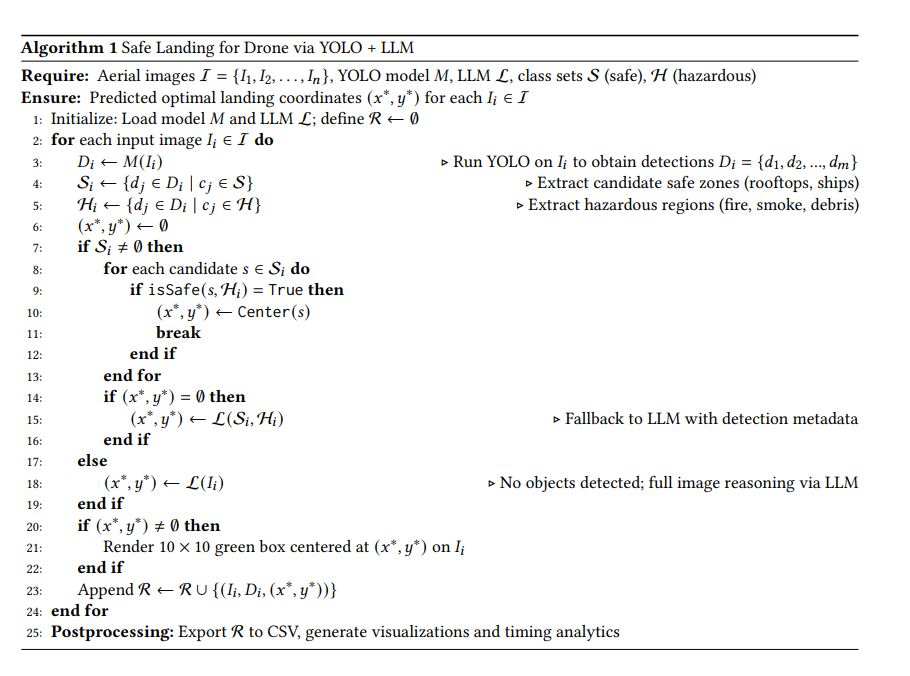

# Proposed Novel Algorithm: Vision + LLM for Landing Site Selection

**Author**: Prathamesh Chatorikar  
**Affiliation**: University of California, Santa Cruz  
**Date**: March 2025  

---

## Abstract

This repository introduces a hybrid system for identifying safe landing zones for drones using aerial imagery. The system leverages state-of-the-art object detection (YOLOv11) in conjunction with spatial reasoning powered by large language models (GPT-4 Turbo). The methodology ensures optimal landing zone selection by avoiding hazardous regions such as fire, smoke, debris, and solar panels, and by prioritizing zones such as rooftops and ships when available.

---

## Methodology Overview

The framework operates in two stages:

1. **YOLO-Based Detection**  
   Utilizes YOLOv11 Nano to detect both hazardous and safe zones in aerial imagery.
   
2. **Post-Processing and Reasoning**  
   Applies a custom-designed algorithm (Algorithm 1) to evaluate rooftop safety. In cases where no safe zones are detected or validated, a fallback mechanism invokes GPT-4 Turbo to reason spatially about the best landing location using either:
   - Object-level metadata (Hazard-aware mode), or
   - Entire image context (Full-image mode)

---

## Proposed Algorithm

The decision process is encapsulated in the following algorithmic design:
**Author**: Prathamesh Chatorikar

  

---

## Model and Training Details

- **Model Architecture**: YOLOv8 Nano (Ultralytics)
- **Training Dataset**:  
  Custom Roboflow dataset with the following class labels:  
  - Safe: `rooftop`, `ship`  
  - Hazardous: `fire`, `smoke`, `debris`, `solar-panels`
- **Labeling**: Manual annotation with geometric augmentations
- **Training Infrastructure**: NVIDIA T4 GPU via Google Colab
- **Output Artifacts**: Best weights saved as `best.pt`

---

## Timing and Performance Analysis

Comprehensive timing analysis is conducted across three operational modes:

- YOLO inference time
- LLM-based reasoning with hazard metadata
- LLM-based reasoning using full-image prompts

Results are visualized to compare efficiency and latency across modes.

---

## Full Technical Report

A complete report including background, implementation details, dataset construction, evaluation metrics, and visual results is provided below.

[Download Final Report (PDF)](assets/Prathamesh_Chatorikar_Final_Report.pdf)

---

## Setup and Execution

### Requirements

- Python 3.8+
- OpenAI API access
- Ultralytics YOLOv11 installed
